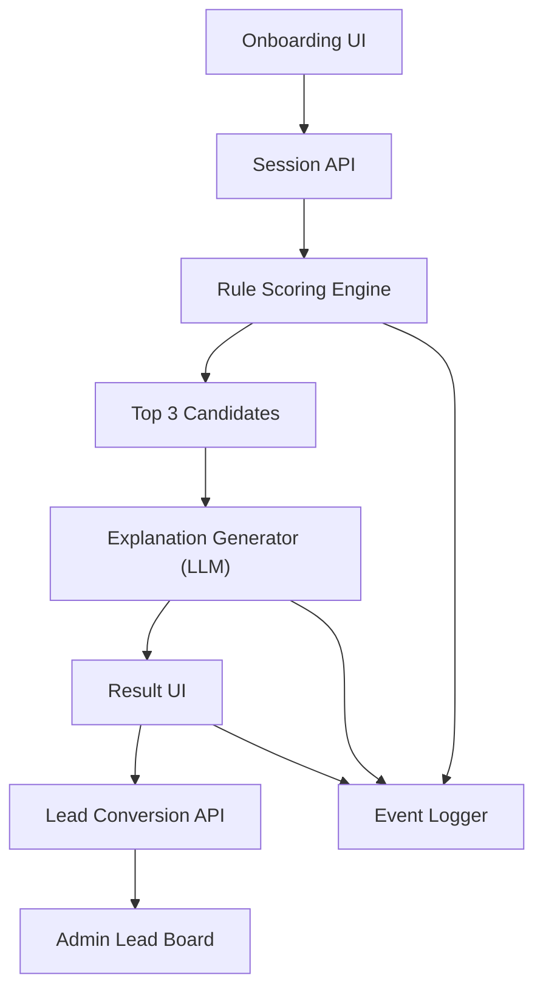

# AI Agent Spec - Rental Decision Agent (v1)

## 1. 목적과 범위

이 문서는 "계약 해석 + 3개 추천" 에이전트를 실제로 구현하기 위한 실행 명세다.

핵심 목적:

- 사용자 입력을 빠르게 수집한다.
- 상품을 점수화해 상위 3개를 고른다.
- 계약 리스크를 쉬운 말로 설명한다.
- 상담 전환에 필요한 요약 정보를 만든다.

MVP 범위:

- 카테고리: 정수기
- 추천 방식: 룰 기반 점수 + 설명 레이어
- 출력: 추천 3개, 추천 이유, 해지/이사 리스크

MVP 제외:

- 자율 의사결정형 AI(모델이 임의로 추천 기준 변경)
- 외부 약관 원문 자동 크롤링
- 결제/설치 스케줄링 자동화

## 2. 에이전트 역할 정의

에이전트는 "판단기"가 아니라 "설명기"다.

에이전트가 하는 일:

- 사용자 조건 요약
- 룰 엔진 결과를 자연어로 설명
- 상품 간 차이를 쉬운 문장으로 비교
- 상담사 전달용 핵심 정보 요약

에이전트가 하지 않는 일:

- 데이터에 없는 혜택/위약금을 추정해 말하기
- 법률/세무/의료처럼 고위험 확정 조언
- 최저가/최고혜택을 단정하는 표현

## 3. 시스템 아키텍처



## 4. 상태머신

세션 상태는 아래 순서를 따라야 한다.

1. `INIT`
2. `COLLECTING_PROFILE`
3. `PROFILE_READY`
4. `SCORING`
5. `EXPLANATION_READY`
6. `RESULT_SHOWN`
7. `LEAD_SUBMITTED` (선택)

실패 상태:

- `ERROR_VALIDATION`
- `ERROR_SCORING`
- `ERROR_EXPLANATION`

전이 규칙:

- 필수 필드 누락 시 `PROFILE_READY`로 가지 못한다.
- 점수 계산 실패 시 설명 생성 단계로 가지 않는다.
- 설명 실패 시에도 결과 3개는 노출하고 템플릿 문구를 사용한다.

## 5. 입력/출력 스키마

## 5.1 Recommendation Session Input

```json
{
  "sessionId": "sess_123",
  "householdSize": 1,
  "residenceType": "jeonse_or_monthly",
  "movingWithin24m": true,
  "budgetRange": "30000_39999",
  "requiredFeatures": ["cold", "hot", "purify"],
  "wantsIce": false,
  "carePreference": "self",
  "spaceConstraint": "high",
  "biggestConcern": "termination_fee"
}
```

필수 필드:

- `householdSize`
- `residenceType`
- `movingWithin24m`
- `budgetRange`
- `carePreference`
- `biggestConcern`

## 5.2 Product Contract Schema (MVP 최소 필드)

```json
{
  "productId": "coway-icon-ice",
  "brand": "코웨이",
  "category": "정수기",
  "monthlyFee": 31900,
  "promoFee": 28900,
  "promoDurationMonth": 12,
  "postPromoFee": 31900,
  "mandatoryUseMonth": 36,
  "contractTotalMonth": 60,
  "managementType": "visit",
  "supportsMove": true,
  "removalFee": 50000,
  "terminationRuleNote": "약정 내 해지 시 위약금 발생",
  "features": ["cold", "hot", "purify"],
  "sizeTier": "slim"
}
```

## 5.3 Recommendation Output Schema

```json
{
  "sessionId": "sess_123",
  "summary": "1인 가구, 전월세, 2년 내 이사 가능성으로 해지 부담이 낮은 상품이 유리합니다.",
  "top3": [
    {
      "productId": "a",
      "score": 78,
      "reasons": ["예산 적합", "셀프관리 선호 일치"],
      "riskNotes": ["중도해지 시 위약금 확인 필요"]
    }
  ],
  "excludedReasons": ["얼음 기능 필수 조건 미충족 상품 제외"],
  "handoffPayload": {
    "priority": "termination_risk",
    "recommendedProducts": ["a", "b", "c"]
  }
}
```

## 6. 추천 로직 설계

총점은 100점 기준으로 계산한다.

점수식:
`totalScore = fitScore(60) + priceScore(20) + careScore(10) + riskScore(10) - penalty`

룰 테이블:

- `movingWithin24m=true` 이고 `mandatoryUseMonth >= 48`면 `-15`
- `budgetRange` 상한보다 `monthlyFee`가 높으면 `-20`
- `carePreference=self`인데 `managementType=visit`면 `-8`
- `wantsIce=true`인데 얼음 기능 없으면 즉시 제외
- `spaceConstraint=high`이고 `sizeTier=large`면 `-10`
- `biggestConcern=termination_fee`면 `mandatoryUseMonth` 가중치 +30%

동점 처리:

1. `postPromoFee`가 낮은 상품 우선
2. `mandatoryUseMonth`가 짧은 상품 우선
3. 동일하면 리뷰/운영 추천 점수 우선

## 7. LLM 설명 레이어 설계

## 7.1 시스템 프롬프트(요약)

- 너는 렌탈 계약을 쉽게 설명하는 도우미다.
- 판단은 이미 주어진 룰 점수를 따른다.
- 입력 데이터에 없는 숫자는 절대 만들지 않는다.
- 과장, 단정, 공포 유도 문장을 쓰지 않는다.
- 출력은 반드시 JSON 스키마를 따른다.

## 7.2 생성 규칙

- 문장 길이: 한 문장 20자~45자 권장
- 용어: "의무사용기간"과 "계약기간"을 항상 분리해 표기
- 금지 문구: "무조건", "절대", "최저가 보장", "위약금 없음"

## 7.3 실패 시 폴백

LLM 응답 실패 또는 JSON 파싱 실패 시 템플릿 기반 설명을 제공한다.

예시 폴백:

- "입력하신 조건 기준으로 예산/관리방식/계약기간을 우선해 3개 상품을 추천했습니다."

## 8. 안전/컴플라이언스 가드레일

- 계약 리스크 문구는 "주의" 형태로 안내하고 확정 법률 해석처럼 쓰지 않는다.
- 수치 근거 없는 총비용 계산은 금지한다.
- 상담 전환 전 필수 고지:
  - "최종 계약 조건은 상담 시 확정됩니다."
- 프롬프트 입력에서 개인정보(이름, 전화번호)는 설명 생성에 전달하지 않는다.

## 9. API 계약 (제안)

## 9.1 POST `/api/recommend/session`

목적: 프로필 저장 + 추천 계산

Request:

- Recommendation Session Input

Response:

- Recommendation Output Schema

## 9.2 POST `/api/recommend/explain`

목적: 룰 결과를 자연어 설명으로 변환

Request:

- `profile`, `rankedProducts`, `topRules`

Response:

- `summary`, `cardReasons`, `riskNotes`

## 9.3 POST `/api/leads`

목적: 상담 리드 저장

Request:

- `sessionId`, `name`, `phone`, `preferredChannel`, `selectedProduct`

Response:

- `leadId`, `submittedAt`

## 10. 이벤트 로깅 설계

필수 이벤트:

- `onboarding_started`
- `onboarding_answered`
- `onboarding_completed`
- `recommendation_rendered`
- `recommendation_card_clicked`
- `lead_cta_clicked`
- `lead_submitted`

이벤트 공통 속성:

- `sessionId`, `timestamp`, `utm_source`, `device_type`

## 11. 운영자 도구 요구사항

- 상품 계약 필드 수정
- 룰 가중치 수정
- 추천 결과 재현(세션 리플레이)
- 리드 상태 관리(신규/연락중/완료/실패)
- 상담 메모 저장

## 12. QA 시나리오

- 필수 값 누락 시 추천 실행 차단
- 얼음 필수 조건에서 얼음 미지원 제품 제외 확인
- 전월세 + 이사 가능 사용자에게 장기 의무사용 상품 감점 확인
- 설명 실패 시 폴백 문구 노출 확인
- 추천 결과와 상담 전달 payload 일치 확인

## 13. 출시 기준

아래를 모두 만족하면 v1 배포 가능:

- 추천 API 정상 응답률 99%+
- 설명 생성 실패율 5% 미만
- 평균 추천 응답시간 1.2초 이하
- 온보딩 완료율 65%+
- 상담 CTA 클릭률 20%+
